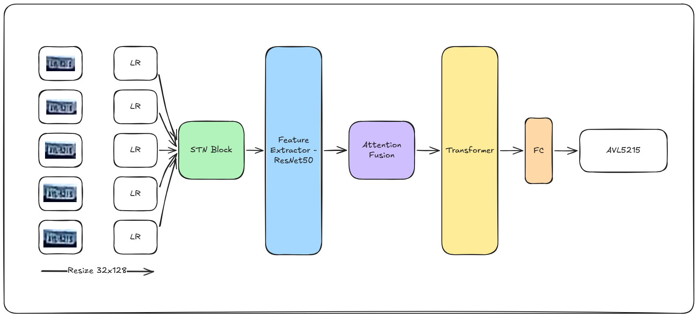

# LowResolution-LPR

**Challenge:** [ICPR 2026 LRLPR](https://icpr26lrlpr.github.io/)

> **Nhận dạng biển số xe độ phân giải thấp (Low-Resolution License Plate Recognition)**  
> Dự án tham dự cuộc thi **ICPR 2026** — sử dụng kiến trúc **ResTranOCR** kết hợp ResNet-50 + Spatial Transformer Network (STN) + Multi-Frame Attention Fusion + Transformer Encoder.


## Tổng quan

Bài toán nhận dạng biển số xe trong điều kiện độ phân giải thấp (LPR on Low-Resolution images) là thách thức lớn trong lĩnh vực computer vision. Dự án này tiếp cận bài toán bằng cách:

- Sử dụng **5 frame** video của cùng một biển số để tổng hợp thông tin (multi-frame)
- Áp dụng **Spatial Transformer Network (STN)** để tự căn chỉnh hình ảnh
- Dùng **ResNet-50** (pre-trained ImageNet) làm backbone trích xuất đặc trưng
- **Attention Fusion** để hợp nhất thông tin từ nhiều frame
- **Transformer Encoder** để nắm bắt ngữ cảnh chuỗi ký tự

Dữ liệu từ cuộc thi **ICPR 2026** gồm hai kịch bản (Scenario-A và Scenario-B) với biển số Brazil và Mercosur, cùng tập test dạng "blind" (track-based).

---

## Kiến trúc mô hình

### ResTranOCR




```
Input: (Batch, 5 frames, 3, 32, 128)
         │
         ▼
   STNBlock          — Spatial Transformer Network: tự học affine transform để căn chỉnh ảnh
         │
         ▼
   FeatureExtractor  — ResNet-50 (pre-trained, stride modified): trích xuất đặc trưng không gian
         │            → Output: (B×5, embed_dim, H', W')
         ▼
   AttentionFusion   — Weighted softmax fusion trên 5 frame
         │            → Output: (B, embed_dim, H', W')
         ▼
   pos_encoding      — Learnable positional encoding
         │
         ▼
   TransformerEncoder — 3 lớp Multi-Head Self-Attention (8 heads)
         │
         ▼
   AdaptiveAvgPool1d — Pool → 7 timestep (tương ứng 7 ký tự biển số)
         │
         ▼
   Linear Head       → Output: (B, 7, 36)  [36 = 10 số + 26 chữ cái]
```


## Cấu trúc dự án

```
LowResolution-LPR/
│
├── config/
│   ├── __init__.py
│   └── config.py               # Configs
├── data/
│   ├── ICPR 2026/              # Dataset 
│   │   ├── train/
│   │   │   ├── Scenario-A/
│   │   │   │   ├── Brazilian/
│   │   │   │   └── Mercosur/
│   │   │   └── Scenario-B/
│   │   │       ├── Brazilian/
│   │   │       └── Mercosur/
│   │   └── test/
│   │       ├── track_10005/
│   │       ├── track_10015/
│   │       └── ...             
│   └── README.md               # Hướng dẫn tải dữ liệu qua DVC hoặc drive
├── models/
│   ├── __init__.py
│   ├── components.py           # Share module
│   └── restransORC.py          # Model tổng hợp: ResTranOCR
├── notebooks/
│   ├── 01_EDA.ipynb            # EDA dữ liệu
│   └── 02_Resnet + Transformer ORC MultiFrame.ipynb  # Training notebook 
├── trainers/
│   ├── __init__.py
│   └── trainer.py              # Chứa thành phần của hàm train
├── predict/
│   ├── __init__.py
│   └── predictor.py            # predict_blind_test(): inference trên tập test blind
├── utils/
│   ├── __init__.py
│   └── text_codec.py           # Encode và Decode label
│
├── visualization/
│   ├── __init__.py
│   └── visualizer.py           # Chứa hàm visual sample
├── weights/
│   └── ResTranOCR.pth          # Weights
├── requirements.txt
└── README.md
```

---

## Cài đặt môi trường

### 1. Clone repository
```bash
git clone <repo-url>
cd LowResolution-LPR
```

### 2. Tạo conda environment
```bash
conda create -n <name> python=3.11 -y
conda activate <name>
```

### 3. Cài dependencies
```bash
pip install -r requirements.txt
```


---

## Huấn luyện

Huấn luyện thực hiện qua notebook:

```
notebooks/02_Resnet + Transformer ORC MultiFrame.ipynb
```


### Pipeline huấn luyện

1. **Warmup** (3 epoch đầu): Freeze `FeatureExtractor`, chỉ train STN + Fusion + Transformer
2. **Full training**: Unfreeze toàn bộ mô hình
3. **Gradient clipping**: `max_norm=5.0`
4. **Scheduler**: `CosineAnnealingLR`
5. **Lưu checkpoint**: Mỗi khi `val_acc` tốt nhất được cải thiện → `weights/ResTranOCR.pth`
6. **Early stopping**: Dừng sau `early_stop_count=5` epoch không cải thiện

### Loss & Accuracy

- **Loss**: `CrossEntropyLoss` trên từng ký tự (7 vị trí × 36 lớp)
- **Accuracy**: Tính **exact match** — biển số được tính đúng khi **tất cả 7 ký tự** đều đúng

---

## Dự đoán & Đánh giá

### Inference trên tập test blind

```python
from predict import predict_blind_test

results = predict_blind_test(
    model=model,
    test_loader=test_loader,
    vocab=cfg.vocab,
    device=cfg.device,
    save_path="notebooks/test_predictions.csv",
    checkpoint_path="weights/ResTranOCR.pth"
)
```

Kết quả được lưu vào file CSV định dạng:
```
track_id,plate_text
track_10005,ABC1234
track_10015,XYZ5678
...
```

---

### Visualization

```python
from visualization import visualize_val_samples, visualize_predictions

# Xem mẫu validation trong lúc train
visualize_val_samples(model, val_loader, vocab=cfg.vocab, device=cfg.device)

# Xem kết quả inference (test hoặc blind test)
visualize_predictions(model, loader, vocab=cfg.vocab, device=cfg.device, n_samples=6, mode="test")
```

---


